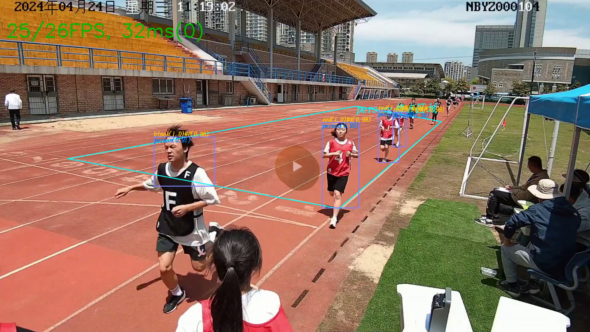
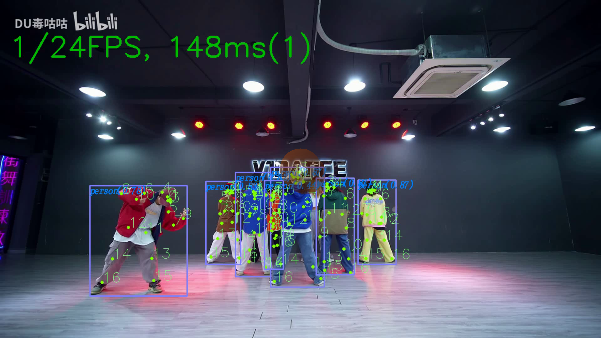
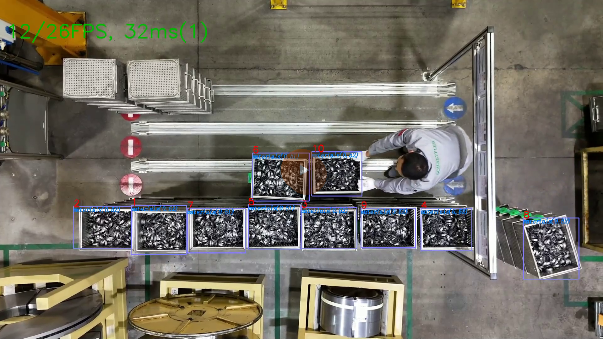
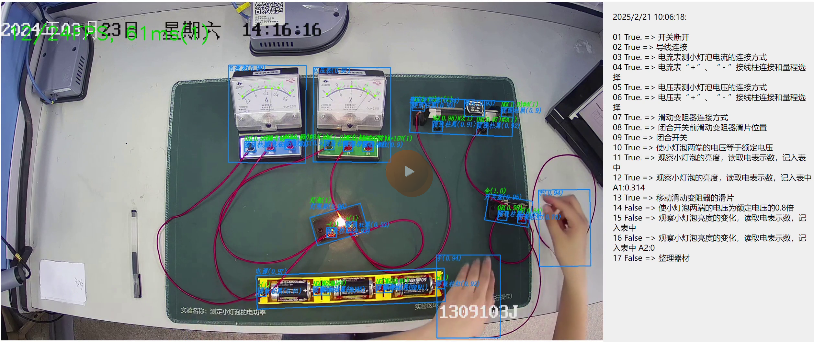
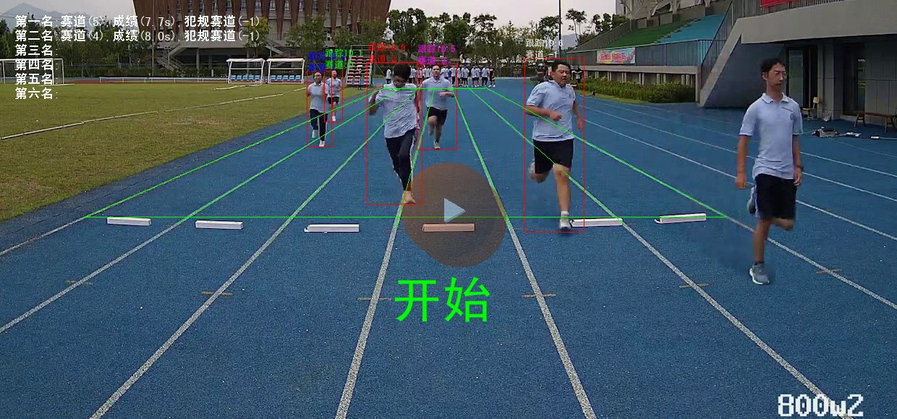

<p align="center">
  
</p>

<p align="center">
  CPipe 是基于 Python 的 AI 视觉算法快速部署框架
</p>

<p align="center">
  
  
  
  
  
</p>

<p align="center">
  <a href="#项目简介">项目简介</a> ·
  <a href="#核心能力">核心能力</a> ·
  <a href="#视频演示">视频演示</a> ·
  <a href="#安装与部署">安装与部署</a> ·
  <a href="#版本更新">版本更新</a> ·
  <a href="#联系方式">联系方式</a>
</p>

---

## 项目简介

CPipe 是基于 Python 的 AI 视觉算法快速部署框架。  
框架采用 Node 思想，将视频流/视频文件/AI 算法/上报信息/业务逻辑统一抽象为 `Node` 节点，并通过连线自由组合成业务 Pipeline。

## 核心能力

- 支持 Node 节点网页可视化编排
- 支持算法推理结果网页实时可视化
- 支持一键快速部署与 Docker 交付
- 支持 GPU 视频解码加速
- 支持页面添加/删除视频流节点
- 支持页面配置算法区域（ROI）
- 支持模型格式：TensorRT / ONNX / PyTorch 等
- 支持算法类型：目标检测、旋转检测、分类、人脸识别、质量评估、关键点、跟踪、ReID、OCR、视频时序分类等
- 支持输入源：RTSP / RTMP / 本地视频 / 本地图片
- 支持日志本地存储、云端上报、网页实时显示
- 支持模型文件加密
- 支持 MCP 协议（需 Python 3.10+）
- 支持云端推理

## 框架优势

| 内容 | 使用前 | 使用 CPipe + 训练平台 |
| --- | --- | --- |
| 算法工程师经验 | 3 年以上 | 1 年以上 |
| 开发周期缩减 | 无 | 缩减 80% 以上 |
| 算法部署环境 | 需要自行搭建 | 框架提供 Docker 镜像 |
| 算法硬件加速 | 需要自己编写代码 | 框架自带 |
| 视频编解码加速 | 需要自行编译硬件库 | 框架自带 |
| 视频流批量推理 | 需要并发开发 | 框架自带 |
| 一键无代码部署 | 无 | 框架自带 |
| 算法性能可视化 | 无 | 框架自带 |
| 算法结果实时 Web 可视化 | 需要前端参与 | 框架自带 |
| 默认算法支持 | 无 | 自带十几种算法 |
| 算法文件加密 | 需要自研加密程序 | 框架自带 |
| 日志系统 | 需要自研 | 框架自带 |

**业务价值：** 降低研发成本、减少开发周期、提供稳定高性能推理引擎、支持高并发视频流实时推理、增强模型安全。

## 可视化效果

### 框架总览


### Web 实时显示效果


## 视频演示

> 点击图片可跳转视频

| 场景 | 演示 |
| --- | --- |
| 中长跑项目 | [](https://www.bilibili.com/video/BV1ep8czHEKu) |
| 人体检测 & 人体关键点 | [](https://www.bilibili.com/video/BV1LJ8czWEnY) |
| 物料跟踪 | [](https://www.bilibili.com/video/BV1vJ8czWE79) |
| 物理实验 | [](https://www.bilibili.com/video/BV15J8czWEXE) |
| 50 米短跑 | [](https://www.bilibili.com/video/BV15J8czWE9U) |

## 使用教程

- 使用手册：可以参考examples目录下的示例代码，以及doc目录下的文档手册
- 可以通过网页RAG问答功能，可以快速解决用户问题

## 安装与部署

### 环境要求

- Python `>= 3.10`（4.x 推荐）

### Wheel 安装示例

```bash
pip install cpipe-4.2.0-cp310-cp310-linux_x86_64.whl
```

### Docker 使用示例

```bash
wget http://code-x.oss-cn-hangzhou.aliyuncs.com/zh/__docker__/cpipe3.7.4_4090_570.195.03.tar
docker load -i cpipe3.7.4_4090_570.195.03.tar
sudo docker run --name cpipe3 --runtime=nvidia --net=host -e TZ=Asia/Shanghai --env LANG="zh_CN.UTF-8" -dit -v ~:/host --privileged --shm-size=64g cpipe /bin/bash
```
### 4.2版本使用示例

```bash
wget http://code-x.oss-cn-hangzhou.aliyuncs.com/zh/__docker__/cpipe4.2.tar
docker load -i cpipe4.2.tar
sudo docker run --name cpipe4 --runtime=nvidia --net=host -e TZ=Asia/Shanghai --env LANG="zh_CN.UTF-8" -dit -v ~:/host --privileged --shm-size=64g cpipe4.2 /bin/bash
```

### 快速安装

- CPipe 4.x 新增 UV 快速安装模式，教程见 `examples/cpipe_install_from_uv`。

## 版本更新

### 版本更新记录

### CPIPE4.2.1版本:
1. 新增支持opencv cuda pip安装包直接安装无需编译(基于nvidia pip安装环境)
2. 优化wheel安装包, 现在默认一个cpipe-4.**-cp310-abi3-linux_x86_64.whl包就可以在python3.10及以上版本直接安装
3. 优化agent采用deepagents库

### CPIPE4.2版本:
1. 升级agent库langchain到1.2.9版本
2. 优化agent对话页面效果, 支持页面实时显示agent创建的新节点.
3. 新增feishu report节点, 支持飞书消息上报功能
4. agent聊天支持飞书机器人模式,可直接通过飞书机器人进行图片/文字聊天
5. 飞书机器人增加STT本地模型(基于onnx int8模型),同时增加语音聊天功能
6. 调整agent逻辑代码增加CAgent模块
7. cpipe增加RAG问答功能
8. 所有Node新增Node.EVENT_SET_UNWORKING_CONSUMER_NAMES事件, 支持设置当前节点不工作的消费者节点名称列表(不往下传递CData数据)
9. 调整 agent tool 工具注册方式, 使用 @Node.agent_tool(name="tool_name", description="The description of the tool.", parameters={}) 装饰器注册 agent 工具
```python
from cagent.core.tools import ToolResult

@Node.agent_tool(name="tool_name", description="The description of the tool.", parameters={})
def tool_name() -> ToolResult:
    return ToolResult(success=True, output="tool_name")
```

### CPipe 4.0（仅支持 Python 3.10+）

1. MCP 添加：`create_node` / `create_edge` / `get model file info list` / `get node class parameters` / `get node support type list` / `get nodes info` / `get nodes mask` / `set node mask` / `set show arguments`
2. 系统提示词优化及添加
3. Flask API 迁移到 FastAPI
4. 集成 agent 代码到 CPipe
5. 优化人脸识别工作量 MCP 提示词
6. 优化 Pydantic 入参检测
7. 修复 wheel 包参数说明显示问题
8. 修复 wheel 包后 agent 模式与 insight 显示冲突
9. 优化 agent 协程模式 MCP context 跨协程释放问题
10. 新增 PPHGNet 节点和 `Box.person.person_attribute` 字段
11. 人脸识别支持删除与添加人脸
12. Web 增加聊天页（支持对话与文件上传）
13. 新增 `audioreport`，支持 `kokoro-82M` TTS
14. 支持多线程多路视频录像
15. 新增 websocket-flv 拉流
16. 新增 `HKO_AddBoxes`
17. 升级 websocket，`CWebsocket` 支持接收回调
18. 优化 mmshufflnet 预处理 bug
19. `videostreamer` 支持 `short_connection_delay` 动态修改
20. 新增部署平台对接能力（参数解析与结果上报）
21. 新增 `VideoMAE` 节点
22. 新增 `Yolov11Pose` 节点
23. 构建 Python 3.10 版 Docker 镜像
24. 新增 `SAM3` 节点（支持文本提示）
25. 全节点支持 pause 事件 `event_send("pause_node", True/False)`
26. 升级所有 report 节点，支持双向通信
27. 优化 insight 视频动态保存和启动
28. `VideoStreamer` 本地文件模式支持快进快退
29. 新增 UV 快速安装教程和 4.0 示例风格更新

<details>
<summary><strong>历史版本（3.7.6 ~ 3.0.0）</strong></summary>

### V3.7.6（2025-10-27）
- 新增 `HKO_AddBoxes` 钩子函数  
  ```python
  hook_outputs = HKO_AddBoxes(-1, {"streamers1": [[0, 0, 100, 100, 0.5, 0], [100, 100, 200, 200, 0.6, 1]]})
  ```
- 升级 websocket，`CWebsocket` 增加接收回调
- 优化 mmshufflnet 预处理 bug
- `videostreamer` 增加 `short_connection_delay` 动态修改
- 新增部署平台功能
- 优化视频保存等部分功能
- 增加更多 ARM 版本 wheel 文件

### V3.7.5 / V3.7.4（2025-08-22）
- `VideoStreamer` 支持 `rotate` 参数（90/180/270）
  ```python
  stream1 = VideoStreamer("ss1", "/mnt/d/videos/other/face_2.mp4", 3, 1, rotate=90)
  ```
- 节点 event 支持双向返回
  ```python
  @Node.event("print_event")
  def print_event(self, data):
      print(f"print_event: {data}")
      return "hello world"

  ret = self.event_send("print_event", "hello")
  print(ret)
  ```
- 优化 cv2 内存泄漏问题

### V3.7.2（2025-07-28）
- 新增 `Node.on_startup(order=0)` 启动前装饰器
  ```python
  @Node.on_startup(1)
  def before_start(self):
      print("before_start")
  ```
- 新增 `Node.event(func_name)` 装饰器
- 新增 `CPipeInsight.get_current_show_image()` 获取当前显示图像
- 优化 TensorRT 推理流程，减少手动依赖安装

### V3.7.1（2025-07-11）
- 新增 `MCPStreamer` / `MCPReport`，支持 MCP 协议链路
- 优化 Node 页面 Queue 显示逻辑
- 新增阻塞超时参数 `BLOCKING_MODE_TIMEOUT`
- 支持 MCP 云端推理示例
- 新增模型单独推理示例、区域绘制示例、`fastsam` 节点
- 新增 Web 页面画区域实时生效
- 新增节点 event 功能并扩展 hook 参数
- `CMask` 改造为共享内存模式
- 支持动态视频分辨率自动适配
- 支持流启动失败自动重试连接

### V3.6.0（2025-05-30）
- 新增大量示例：编译、绘制、自定义节点、日志、RK3588、Atlas300、ROI、Web 文本显示等
- 所有算法节点支持 `hook_inputs` / `hook_outputs`
- 新增 `HKI_DilateImage`、`HKI_CropImage`、`HKO_ClassNamesThresholdFilter`、`HKO_DumpClass`
- 优化本地文件模式帧率
- `yolov8OBB` 增加 `Box.box_angle`
- 增强华为昇腾 300 芯片适配（yolov7 / yolov8OBB / movenet / RTMPOSE / MMshufflenet）
- 新增动态 BatchSize 的 `CACLModel`
- 新增 OCR 识别能力与 `box_text` 字段

### V3.5.8（2025-04-29）
- 支持所有模型 ONNX 转 TensorRT（见 `examples/onnx2tensorrt/demo.py`）
- 增强 Ctrl+C 退出资源释放并修复卡死
- 新增 `MMResenet50` 模型节点

### V3.5.6（2025-03）
- 增加 cpipe 格式加密模型能力
- `VideoStreamer` 支持本地 USB 摄像头
- 新增部分示例并适配 onnxruntime 新版本

### V3.5.5（2025-03-26）
- 优化麒麟系统 U 盘插拔导致 license 失效
- `retinafaceTRT` 支持一阶段检测
- 新增 `examples` 目录与 `CPipeTools` 类
  ```python
  from cpipe.tools.cpipetools import CPipeTools
  CPipeTools.encrypt_models("./movenet_person_pose.onnx", "1234567890123456", "./1234567890123456.cpipe.license")
  CPipeTools.encrypt_models("./models", "1234567890123456", "./1234567890123456.cpipe.license")
  ```
- 增加 RK3588 适配（yolov7 / retinaface / adaface / facerecognition）
- 增加 yolov7 ONNX 结构适配说明
  
- 优化 WSL license 问题
- 增加 retinaface ONNX 模型适配

### V3.5.0（2025-03-11）
- `VideoStreamer` 支持动态 `process_frame_interval`
- 新增 `DinoEmbedding` / `DinoClassifier`
- `Box` 新增 embedding 相关字段
- 新增 `yolov11TRT`、`YOLOv11InstanceSeg`、`MoveNetPersonPose`
- 新增日志文件名标识配置
- `ImageStreamer` 支持动态喂图（路径或 numpy array）
- 新增 `CImage.info` 字段
- 修复 WSL 与麒麟系统重启后 license 失效

### V3.2.2（2024-12-25）
- 优化 CPipe 退出机制，统一回收子进程并执行 `Node.lastly`
- 新增 Node `daemon` 参数
- logger 新增 warning 并优化显示
- 将 `SaveInsight` / `UIInsight` 整合进 `CPipeInsight`
- moveNet 支持不同输入尺寸
- 新增 https 支持（`ssl=True`）
- 合并 `LocalVideoStreamer` 与 `VideoStreamer`
- `VideoStreamer` 支持 `reset_stream` 动态改流

### V3.2.0（2024-12-02）
- 所有模型支持灰度模式
- 新增 RTMPOSE 手掌关键点
- 修复日志 bug
- Node 类新增 `lastly` 退出回调
- `CPipeInsight` 增加多项显示控制参数

### V3.1.1（2024-11-15）
- 增加代码注释
- 增加分割模型支持
- 修复 bug

### V3.0.0（2024-10-18）
- 统一推理框架，新增基础类 `Cmodel` / `InferenceEngine` / `CDetector` / `COBBDetector` / `CClassifier` / `CFace` / `CEmbedding`
- 优化跳帧显示逻辑和 Node 页面（antv x6）
- 支持通过 `config/launch.yaml` 快速生成 Node 链路
- 默认支持 CMask 标定能力
- 支持页面动态添加 streamer 并自动识别流类型
- 增加 CPU/CUDA 拉流并存模式
- 增加日志分级颜色显示
- TRT/ONNX 支持多 GPU（`device=cuda:x/cpu`）

</details>

## 联系方式


- 邮箱：`9838465@qq.com`

---

<p align="center">
  如果这个项目对你有帮助，欢迎点个 Star ⭐
</p>